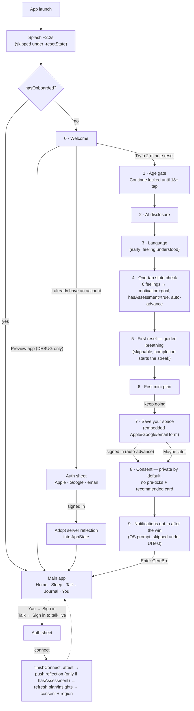

# CereBro — Architecture

> System map for developers. Companions: [TECHNICAL.md](TECHNICAL.md) (setup, env, testing, deploy),
> [TODO.md](TODO.md) (known debt + open work), root [CLAUDE.md](../CLAUDE.md) (session context).

## System overview

```
┌─────────────┐     ┌──────────────┐     ┌────────────────────────────┐
│  iOS app    │     │  Web landing │     │  Admin dashboard           │
│  (SwiftUI)  │     │  (Next.js)   │     │  (Next.js)                 │
└──────┬──────┘     └──────┬───────┘     └──────────┬─────────────────┘
       │  REST + SSE       │ POST /waitlist         │ /auth/login + /admin/*
       └───────────────────┴────────────┬───────────┘
                                        ▼
                          ┌─────────────────────────┐      ┌ OpenAI / Anthropic (LLM)
                          │  FastAPI backend        │──────┤ Deepgram (STT)
                          │  (async SQLAlchemy)     │      ├ ElevenLabs (TTS)
                          └───────────┬─────────────┘      ├ Apple / Google (sign-in JWKS)
                                      ▼                    ├ APNs, SMTP, Twilio
                          ┌─────────────────────────┐      └ App Store Server API (JWS)
                          │  Postgres 16            │
                          └─────────────────────────┘

Prod: Caddy (auto-HTTPS) is the only public service →
  cerebrozen.in / www → web:3000 · admin.cerebrozen.in → admin:3001 ·
  app.cerebrozen.in → app:3002 · api.cerebrozen.in → api:8000
```

Every external provider is optional: the backend picks providers at runtime by key
presence and degrades to deterministic local fallbacks, so the whole stack runs
offline with blank keys.

## Monorepo layout

```
cere/
  apps/ios/       SwiftUI iOS app (primary client) + XCUITests + fastlane
  apps/android/   Kotlin + Compose: full client (2026-07-12 evidence-based redesign — see
                  docs/REDESIGN.md): 5 tabs + ~34 routes, unified breathe engine, Toolkit hub,
                  one Sounds hub (Player/SoundscapeMixer exclusivity via cross-stop), dual
                  Night/Dawn theme (theme-aware token getters in ui/theme, AppTheme state,
                  ContrastTest gate), InfoBanner slot on Home, crisis ≤2 taps (Tele-MANAS-first)
  apps/web/       Next.js 14 marketing site (port 3000)
  apps/admin/     Next.js 14 admin dashboard (port 3001)
  apps/app/       Next.js 14 authenticated web app (port 3002, app.cerebrozen.in)
  backend/        FastAPI + Postgres (auth, data, proactive AI, voice, Oracle agent)
  e2e/            Playwright tests (web + admin) in an isolated Docker stack
  deploy/         Caddyfile + bootstrap.sh (one-shot VPS setup)
  docs/           This doc set + release/privacy/ship checklists
  docker-compose.yml / .e2e.yml / .prod.yml
  .github/workflows/  ci.yml · deploy.yml · testflight.yml
```

## Backend (`backend/app`)

### Layers

- `main.py` — app factory: CORS, slowapi rate-limit middleware, security headers, `/health`.
- `core/` — `config.py` (pydantic-settings, `_guard_production` boot guard), `database.py`
  (async engine/session), `security.py` (JWT HS256 + bcrypt; token types access/refresh/verify/reset),
  `deps.py` (`get_current_user` checks `token_version` for revocation; `get_current_admin`),
  `ratelimit.py`.
- `api/routes/` — thin endpoint modules; `api/router.py` aggregates.
- `services/` — all business logic + provider adapters (22 modules; `prompts.py` is the
  versioned prompt registry every LLM call site reads through).
- `models/` — SQLAlchemy ORM; `schemas/` — Pydantic I/O.
- `agent/` — LangGraph "Oracle" (graph.py, tools.py, context.py).
- `prestart.py` — wait-for-db → `alembic upgrade head` (falls back to `create_all`) → seed.

### Routes (summary)

| Prefix | Highlights |
| --- | --- |
| `/auth` | signup, login (lockout 5 fails/15 min), apple (bundle-id or Services-ID audience), google, otp/request + otp/verify (emailed 6-digit passwordless sign-in: find-or-create, single-use, 10 min TTL, burns after 5 wrong tries, hashed at rest), refresh (rotates; checks `token_version`), logout (revokes all tokens), verify + password-reset link flows, me |
| `/users/me` | profile, attest (18+/AI disclosure; optional client tap-time, honored only when past), subscription/verify (StoreKit2 JWS), trusted-contact CRUD, consent, export, hard DELETE (cascade + minimal Rule 8(3) `deletion_ledger` row: hashed email only, 12-month ops purge), push-token, push-subscriptions (Web Push: status+VAPID key GET / register POST / unregister DELETE), streak (server mirror of the iOS rules) |
| `/assessment` | structure (taxonomy), topics (LLM or curated fallback conversation starters) |
| `/moods` `/journal` `/chat` | CRUD + side effects: mood → contextual nudge; journal/chat → safety scan; chat → quota → LLM reply → activity widget |
| `/sleep` | sleep diary: upsert-by-date (one entry/night), range list, weekly summary (avg duration/quality, bedtime consistency, trend — `enough_data`-gated); upsert re-anchors the `wind_down` nudge to the user's average bedtime |
| `/plans` | active (lazily generated), generate, step patch |
| `/programs` | multi-day journey enrollment (ref "DAY X OF 7" card): active (day computed from start date — nothing to advance or fail; when the program has per-day `day_guides`, additively carries `today_guide` `{title, body}` for the current day, clamped to the last guide), enroll (one at a time; replaces), leave |
| `/insights` `/nudges` `/content` | weekly aggregation (on demand), patterns (transparent-AI-memory statements derived from the user's own 60-day data, per-source consent-gated, each with its `basis` counts; paired with `DELETE /users/me/memory` = chat + insights + Oracle checkpoint wipe), scheduled nudges, public catalogue |
| `/oracle` | status, messages (SSE stream), confirm (resume paused write-tool) |
| `/voice` | status, stt (Deepgram, 10 MB cap), tts (ElevenLabs) |
| `/events` | anonymous first-party product events (allowlisted names, random install id, deliberately NO auth so rows can't join to accounts; unknown names dropped) |
| `/admin` | stats, users (+ metadata-only detail view), first-party `metrics/overview` (DAU/WAU/MAU, Dn retention, funnel, engagement — aggregates only) + `metrics/funnel` (onboarding steps/paywall from anonymous events, unique installs), content CRUD (+ `content/{id}/narrate` — synchronous ElevenLabs narration from the item's `narration_script`, 3/min, 503 keyless), prompt registry (versioned LLM prompts: list / save-new-version / activate / revert-to-code-default), nudge authoring (one user or broadcast) + list, safety review queue, nudges/dispatch (manual cron), waitlist |
| `/billing` | Stripe Checkout session for the web app (503 until `STRIPE_*` configured; iOS stays on StoreKit) |
| `/webhooks/appstore` | App Store Server Notifications V2 (JWS-authenticated, keyed by `appAccountToken`) |
| `/webhooks/stripe` | Stripe subscription lifecycle (HMAC `Stripe-Signature`, user via checkout `client_reference_id`/subscription metadata) — same `subscription_tier` contract |
| `/media` | StaticFiles mount over `MEDIA_ROOT` (public, like `/content`; Range/ETag so native players stream + seek) — generated narration MP3s live at `/media/narration/{content_id}.mp3` (prod: named `media` volume) |

### Key services

- `ai.py` — runtime LLM switch: OpenAI if `OPENAI_API_KEY` → Anthropic if `ANTHROPIC_API_KEY` → none.
  Returns `None` on any failure so every caller has a deterministic fallback.
- `safety.py` — crisis classifier (LLM JSON primary, keyword fallback) → `SafetyEvent` →
  `escalation.py` (ops email + consent-gated trusted-contact email/SMS). Never blocks the user.
- `crisis.py` — region → hotline map; server mirror of iOS `CrisisResources.swift` (keep in sync).
- `agentic.py` — daily plan from goals + recent mood + sleep diary (LLM or `_STEP_LIBRARY`;
  short/rough nights put a wind-down step first).
- `activities.py` — deterministic chat → inline widget routing (`widget_kind` mirrors iOS `ActivityDestination`).
- `usage.py` — free-tier daily message quota (429; premium tiers unlimited).
- `appstore.py` — StoreKit2 JWS verification (ES256 chain; root-pinned only when
  `APPSTORE_ROOT_CERT_PATH` is set) + notification → tier mapping.
- `nudges.py`/`notifications.py`/`webpush.py` — scheduling + APNs + Web Push. Delivery runs
  in-process: a lifespan task in `app.main` calls `dispatch_due` every
  `NUDGE_DISPATCH_INTERVAL_MINUTES` (rows claimed with `FOR UPDATE SKIP LOCKED`, so multiple
  workers are safe); outcomes are `sent`/`skipped`/`failed`. Preference order for users
  without a native push token: browser Web Push (VAPID, `web_push_subscriptions`; dead
  404/410 endpoints pruned in place) → email when opted in (`users.email_nudges`) → honest
  `skipped`. `POST /admin/nudges/dispatch` remains as a manual pass.

### Oracle (LangGraph agent)

Tool-calling chat agent (suggest_activity, log_mood, save_journal, log_sleep, get_weekly_insights) with
confirm-before-write: write tools call `interrupt()` → SSE emits `tool_confirm` → client approves via
`/oracle/confirm` → `Command(resume=...)`. Request-scoped DB/user passed via contextvars.
Enabled by `ORACLE_ENABLED=true` + an LLM key; otherwise clients fall back to `/chat`.
State checkpoints to Postgres (`AsyncPostgresSaver` on the app DB), so paused confirmations
survive restarts and resume on any gunicorn worker; MemorySaver is only a logged dev fallback.
The graph warms in the app lifespan **before traffic**: checkpointer `setup()` issues
`CREATE INDEX CONCURRENTLY`, which any idle-in-transaction pool connection blocks
indefinitely — first-request init on a fresh DB hung forever until this (plus a 30 s
setup timeout as the fallback).

### Data model

`users` (auth-hardening, subscription, compliance, region, push_token fields) with 1:1 `consents`,
`trusted_contacts`; user-scoped: `mood_logs`, `journal_entries`, `chat_messages`, `plans`+`plan_steps`,
`nudges`, `insights`, `safety_events`, `sleep_logs` (one diary row per user per date),
`web_push_subscriptions` (browser endpoints; unique per endpoint, adopted by the last account).
Global: `content_items`, `waitlist_entries`, `prompt_templates` (versioned LLM prompt registry —
immutable versions per name; the active row overrides the in-code default in
`services/prompts.py`, no rows = code default, so dev/CI run identically with an empty table).
UUID PKs, `created_at`, JSONB for goals/motivations/tags/metrics. Every user FK is
`ondelete=CASCADE` so `DELETE /users/me` cascades (App Store 5.1.1(v)). Migrations: Alembic (15 revisions).

## iOS app (`apps/ios/CereBro`)

100% SwiftUI, zero external dependencies, iOS 17+, dark-only. ~9.2k LOC across feature folders.

- **State** — `ObservableObject` + `@Published`; two root env objects: `AppState` (all local data,
  write-through to UserDefaults via `didSet`) and `BackendService` (cloud session).
- **Persistence** — UserDefaults only (JSON-encoded Codable blobs). No CoreData/SwiftData.
  `-resetState YES` launch arg wipes + seeds demo state for deterministic UI tests.
- **Networking** — `APIClient` actor (URLSession, 15 s timeout); base URL `http://localhost:8000`
  in DEBUG, `https://api.cerebrozen.in` in Release (runtime-overridable, persisted). Bearer JWT in
  UserDefaults; 401/403 → `unauthorized`. Cloud sync is **strictly additive**: offline the app is a
  full local product; when connected, writes best-effort mirror and plan/insights are server-driven.
- **Voice loop** (`VoiceCompanion`) — mic (AAC 16 kHz) → `/voice/stt` → Oracle SSE (sentence-by-sentence
  TTS via `SentenceQueuePlayer`) or `/chat` + single TTS → playback. VAD endpointing (~1.5 s silence),
  barge-in (tap to interrupt), audio-interruption handling. Signed-out → `LocalCompanion` canned replies.
- **Chat** (`ChatActivities`) — Oracle SSE frames (token/crisis/widget/tool_confirm/done) render
  streaming bubbles, inline `ActivityWidgetCard` → native activity screens, `ToolConfirmCard`,
  starters + suggestion chip rails, `CrisisBanner`.
- **Sleep audio** (`SoundscapePlayer`) — bundled seamless loops (`Resources/Sounds/*.m4a`) via
  AVAudioEngine, procedural synth fallback, lock-free mixer, MPNowPlayingInfo/remote commands,
  fade-out sleep timer. Engine disabled under `-resetState` (Simulator CoreAudio stability).
- **Sleep diary** (`SleepEntry` + `Features/Sleep/SleepCheckIn.swift`) — morning check-in
  (felt quality, bed/wake wall-clock minutes, awakenings), 7-night trend strip (real data
  only; averages gated behind 3 logged nights), history. Local-first in `AppState`,
  best-effort mirrored to `/sleep` (upsert by date). `-resetState` seeds 3 past nights,
  today deliberately unlogged.
- **Design system** (`DesignSystem/Theme.swift`) — one-directional token hierarchy
  `Brand` (raw hex, never used by screens) → `Palette` (semantic) → `Accent`/`Radius`/`Stroke`/`Gradient`.
  Screens read tokens only; no raw hex outside Theme.swift + SplashView scenery.
- **Safety** — `CrisisResources.swift` region directory (US/CA/GB/IE/AU/NZ/IN + intl default) with
  a user override picker; persistent AI-disclosure banner + 3-hourly re-disclosure sheet on Talk/Chat.
- **Tests** — XCUITest only (no unit target); ~18 screenshot walk-through tests; live-backend
  tests `XCTSkip` when the API is unreachable.

### Entry, onboarding & auth flow

"90-second to calm" ordering: legal gates fast, one feeling tap, a real breathing reset and
the first mini-plan BEFORE any account ask; consent is private-by-default; the reminder ask
comes after the first win. Returning users never re-walk the tutorial — Welcome signs in directly.



Connect-time sync rules (any sign-in path): `finishConnect` records the age/AI-disclosure
attestation, pushes the local self-reflection **only when actually answered**
(`AppState.hasAssessment` — app defaults must never overwrite a returning user's server
selection), then fetches plan/insights and re-applies consent + crisis region. If the local
reflection was never answered but the server has one, it's adopted into `AppState` instead
(returning-user restore).

### Cross-stack contracts (keep manually in sync)

| Contract | Backend | iOS |
| --- | --- | --- |
| Assessment taxonomy | `services/assessment.py` | `Dummy.motivations` / `Dummy.goalCategories` |
| Activity widget kinds | `services/activities.py` + Oracle tools | `ActivityDestination` in `ChatActivities.swift` ⇄ web `WIDGET_LINKS` (chat page) ⇄ android `widgetRoute` (TalkScreen.kt) |
| Crisis regions/hotlines | `services/crisis.py` | `Safety/CrisisResources.swift` |
| Crisis keywords (offline) | `safety.py` `_CRISIS_TERMS` | `LocalCompanion` |
| Sleep diary schema | `schemas.SleepLogCreate` (`/sleep`) | `SleepEntry` + `APIClient.upsertSleep` |
| Streak rules (grace day, today optional) | `services/metrics.user_streak` | `AppState.currentStreak` |
| Subscription products | `appstore.py` tier map | `Products.storekit` (`com.cerebrozen.premium.{monthly,annual}`, `.premiumhuman.{monthly,annual}`) |
| Onboarding funnel step names | `services/metrics.ONBOARDING_STEPS` | `OnboardingFlow.stepNames` |
| Consent categories (6 flags, per-purpose) | `models/consent.py` + read-site gates | `Models.Consent` + Consent/Privacy screens (web: account page labels) |
| Consent-notice translations (DPDP s.5(3): 13 languages, keys = consent columns) | — (client-side text) | `Trust/ConsentNotice.swift` ⇄ web `apps/app/lib/consentNotice.ts` ⇄ android `ui/screens/ConsentNotice.kt` |
| Analytics event vocabulary + funnel step names | `routes/events.ALLOWED_EVENTS` (+ `source` enum incl. `android`) | iOS `Analytics.track` ⇄ android `net/Analytics.kt` (`funnelStepName` maps to `services/metrics.ONBOARDING_STEPS`) |
| Narration audio (`audio_url` on `/content` items) | `models/content.py` — relative `/media/…` (backend-minted) or absolute (admin-pasted); empty ⇒ client ambient fallback; `narration_script` is admin-only (`AdminContentOut`), never public. NOTE the deliberate asymmetry with `image_url`, which is always absolute | iOS `RemoteContent.audio_url` → `BackendService.resolveMedia` → `SoundscapePlayer` AVPlayer branch ⇄ android `MediaUrls.resolve/register` → `AmbientService` stream-else-bed ⇄ web `mediaSrc()` + `<audio>` (library/sleep pages; CSP `media-src`) |

## Web + App + Admin (`apps/web`, `apps/app`, `apps/admin`)

Next.js 14 App Router, React 18, TS. All consume `NEXT_PUBLIC_API_URL` (baked at build).

- **Web** — single-page landing (`app/page.tsx`, hardcoded content arrays) + `/privacy` + `/terms`
  + robots/sitemap/OG images. `components/Waitlist.tsx` → `POST /waitlist`. Domain `cerebrozen.in`.
- **App** — the authenticated browser client (`app.cerebrozen.in`, deliberately a subset of
  iOS — see WEB_APP_PLAN.md). Session model: access token **in memory only**, refresh token
  in localStorage, one `/auth/refresh` rotation retry per 401 (`lib/api.ts`;
  `authedFetch` is the shared base for JSON, SSE, and blob downloads). v1 pages:
  signin/signup, Today (mood check-in + recent), Chat (Oracle SSE-over-POST via fetch
  streaming — tokens/widgets/tool-confirm/crisis frames — with the deterministic `/chat`
  fallback + suggestion chips), Journal (composer + history + crisis banner on elevated
  risk — never blocks), Sleep diary (morning check-in, honest weekly summary, history),
  Plan (optimistic step toggles, regenerate), Insights (metrics + upcoming nudges),
  Account (consent, crisis region, trusted contact, export download, typed DELETE).
  `noindex`.
- **Admin** — one client component (`app/page.tsx`) with tabs
  overview/analytics/users/content/safety/waitlist. Analytics renders the first-party
  aggregates (`services/metrics.py`); Users offers a metadata-only detail drill-down.
  JWT via `/auth/login` in localStorage; now also stores the refresh token and rotates on
  401 (same pattern as App), so sessions outlive the 30-minute access token.
- Shared brand tokens live as CSS vars in each app's `globals.css` (mirrors iOS Theme;
  extraction to a shared package is tracked in TODO — Docker build contexts are per-app).

## Planned (not built) — see plan docs before extending

Two designed-but-unbuilt tracks, kept out of the sections above so this doc stays a map
of what exists:

- **Sleep tracking module** ([SLEEP_TRACKING.md](SLEEP_TRACKING.md)) — v1 shipped
  2026-07-03: backend `sleep_logs` + `/sleep`, the iOS diary (check-in/trend/history
  + sync), the CBT-I-informed wind-down guide (`wind_down` content kind; Sleep-tab
  rails read `/content` with a `Dummy` offline fallback via `BackendService.catalogue`),
  real server sleep insights (+ data-gated sleep×mood note), bedtime-anchored
  `wind_down` nudges, sleep-aware plan generation, and the `log_sleep` Oracle tool +
  `sleep_checkin` widget kind, and the v1.5 opt-in HealthKit read
  (`HealthKitSleep`, check-in pre-fill only — never writes; portal App ID
  capability pending for devices). Still planned: honest-local iOS insights.
  Non-diagnostic framing is a hard product rule.
- **Web app v1 + admin v2** ([WEB_APP_PLAN.md](WEB_APP_PLAN.md)) — first slice shipped
  2026-07-03: `apps/app` scaffold + auth/refresh session, Today/Journal/Sleep pages,
  infra (CORS origin, Caddy block, compose services, CI typecheck, Playwright spec),
  and the admin refresh fix (admin-v2 item 1). Still planned: chat (Oracle SSE via
  fetch-streaming), plans, insights, content pages, account/consent/export/delete,
  streaks endpoint, admin analytics/user-support/nudge authoring, Stripe web billing
  (maps to the same `subscription_tier` contract as `appstore.py`), Web Push/email
  nudges, Apple sign-in Services ID.

## Infra

- **docker-compose.yml** (dev) — db (5432), api (8000, live-reload bind mount), web (3000), admin (3001).
- **docker-compose.e2e.yml** — isolated network, no host ports; Playwright container waits on
  health then runs 7 tests.
- **docker-compose.prod.yml** — Caddy is the only public service (80/443, auto-TLS via
  `deploy/Caddyfile`); api runs migrations then gunicorn+uvicorn workers as non-root; db and app
  ports internal-only; `restart: unless-stopped`. Boot guard refuses insecure prod config.
- **deploy/bootstrap.sh** — idempotent first-time VPS setup (deploy user, ufw, fail2ban, Docker,
  generated secrets → `.env.production`, compose up).
- **CI** (`ci.yml`) — jobs: `backend` (pytest + coverage gate `--cov-fail-under=95` on Postgres),
  `e2e` (full Docker stack), `ios` (macOS-15 simulator XCUITests; cloud tests self-skip),
  `android` (non-blocking). **deploy.yml** — manual SSH deploy + health check.
  **testflight.yml** — manual fastlane beta (needs `ASC_*` secrets).
