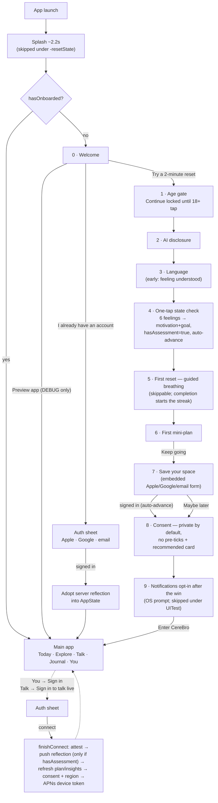

# CereBro — Architecture

> System map for developers. Companions: [TECHNICAL.md](TECHNICAL.md) (setup, env, testing, deploy),
> [TODO.md](TODO.md) (known debt + open work), root [CLAUDE.md](../CLAUDE.md) (session context).

## System overview

```
┌─────────────┐     ┌──────────────┐     ┌────────────────────────────┐
│  iOS app    │     │  Web landing │     │  Admin dashboard           │
│  (SwiftUI)  │     │  (Next.js)   │     │  (Next.js)                 │
└──────┬──────┘     └──────┬───────┘     └──────────┬─────────────────┘
       │  REST + SSE       │ POST /waitlist         │ /auth/login + /admin/*
       └───────────────────┴────────────┬───────────┘
                                        ▼
                          ┌─────────────────────────┐      ┌ OpenAI / Anthropic (LLM)
                          │  FastAPI backend        │──────┤ Deepgram (STT)
                          │  (async SQLAlchemy)     │      ├ ElevenLabs (TTS)
                          └───────────┬─────────────┘      ├ Apple / Google (sign-in JWKS)
                                      ▼                    ├ APNs, SMTP, Twilio
                          ┌─────────────────────────┐      └ App Store Server API (JWS)
                          │  Postgres 16            │
                          └─────────────────────────┘

Prod: Caddy (auto-HTTPS) is the only public service →
  cerebrozen.in / www → web:3000 · admin.cerebrozen.in → admin:3001 ·
  app.cerebrozen.in → app:3002 · api.cerebrozen.in → api:8000
```

Every external provider is optional: the backend picks providers at runtime by key
presence and degrades to deterministic local fallbacks, so the whole stack runs
offline with blank keys.

## Monorepo layout

```
cere/
  apps/ios/       SwiftUI iOS app (primary client) + XCUITests + fastlane
  apps/android/   Kotlin + Compose: full client. **Companion-first since 2026-08-16 (V3–V5):
                  THREE tabs — Home · Chat · Sleep — and the app OPENS ON CHAT**
                  (`startDestination = Tab.Talk.route`). You lives behind the top-bar gear
                  (`CereBroTopBar.onSettings`), Journal is a chat tool plus a room doored from
                  Home; both keep their routes. ~40 routes, unified breathe engine, Practices
                  hub, one Sounds hub (Player/SoundscapeMixer exclusivity via cross-stop),
                  dual Light-Dawn/Night theme (theme-aware token getters in ui/theme, AppTheme
                  state, ContrastTest gate; Dawn is the default since the 2026-08 Light Dawn
                  port), crisis ≤2 taps (Tele-MANAS-first).
                  Design lineage: docs/REDESIGN.md (evidence base) → REDESIGN_V2.md (compact
                  system) → the V3–V5 waves ledgered in docs/TODO.md
  apps/web/       Next.js 14 marketing site (port 3000)
  apps/admin/     Next.js 14 admin dashboard (port 3001)
  apps/app/       Next.js 14 authenticated web app (port 3002, app.cerebrozen.in)
  apps/portal/    Next.js 14 organisation portal (port 3003). All 36 of the
                  prototype's routes (ref/portal.html) as of 2026-08-12, in
                  docker-compose, in CI (tsc + lint), in the e2e stack
                  (portal.spec.ts walks all 36), in sync-tokens TARGETS, and
                  carrying the same nonce CSP as the other three Next apps.
                  FOUR screens are live against /org (dashboard, members,
                  cohorts, programmes) via lib/api.ts — same token model as
                  apps/app, separate storage key. Sign-in is real. The other 32
                  still render lib/mock.ts and each carries a warning notice
                  saying so, because a live and a sample screen otherwise look
                  identical. Forms remain inert everywhere. deploy/Caddyfile
                  still keeps portal.cerebrozen.in commented out: there is no
                  SSO/MFA, so password auth alone is not enough to publish an
                  administration console on.
  backend/        FastAPI + Postgres (auth, data, proactive AI, voice, Oracle agent)
  e2e/            Playwright tests (web + admin) in an isolated Docker stack
  deploy/         Caddyfile + bootstrap.sh (one-shot VPS setup)
  docs/           This doc set + release/privacy/ship checklists
  docker-compose.yml / .e2e.yml / .prod.yml
  .github/workflows/  ci.yml · deploy.yml · testflight.yml
```

The three **guided routines** (wind-down ritual · personal ritual builder · guided imagery)
exist on all three clients and are hand-synced, not shared code: `apps/app`
`(authed)/sleep/ritual` + `(authed)/games/{ritual,imagery}` over `components/RitualSteps.tsx`
· android `ui/screens/Rituals.kt` · iOS `Features/Tools/Rituals.swift`. The ritual itself is
**device-local on every client** (`RitualStore` over the `Session` pref seam on Android and
`UserDefaults` on iOS, `localStorage` on web) — there is no server model for one, and each
screen says so rather than letting the user assume it follows their account.

## Backend (`backend/app`)

### Layers

- `main.py` — app factory: CORS, slowapi rate-limit middleware, security headers, `/health`.
- `core/` — `config.py` (pydantic-settings, `_guard_production` boot guard), `database.py`
  (async engine/session), `security.py` (JWT HS256 + bcrypt; token types access/refresh/verify/reset),
  `deps.py` (`get_current_user` checks `token_version` for revocation; `get_current_admin`),
  `ratelimit.py` — **two keys, both applied (WC-89).** `client_ip` counts the hop our proxy appended (never the one the caller typed); `account_key` counts the subject of a signature-verified access token, falling back to the address when there is no usable session. Stacked rather than swapped, because they catch different abusers — one account from many addresses (addresses are cheap: a VPN sells a list, a residential pool rents thousands by the hour) and many accounts from one address. Applied together on every endpoint whose call spends money: LLM generation, STT, TTS, outbound email. Note the bound is per MINUTE, so it bounds burst and not daily spend; `services/usage.py` is the only daily account cap and it covers chat alone.
- `api/routes/` — thin endpoint modules; `api/router.py` aggregates.
- `services/errors.py` — **structured error tracking (WC-17, 2026-08-22).** An unhandled
  request failure and every background-loop failure are fingerprinted and dispatched to a
  list of sinks; `LogSink` is always registered, so the feature works with nothing configured
  and CI exercises the real path. The report is built by **allow-list** (type, templated
  route, request id, frame positions, an HMAC of the user id) rather than by scrubbing a rich
  context — a deny-list fails open on the field nobody thought of, and on this product that
  field holds a journal sentence. **No vendor is wired**: where an error sink lands is a DPDP
  transfer/retention question before it is a pricing one, so the adapter seam
  (`register_sink`, one `send` method) is built and the choice is left to the owner.
  **Ported to both clients (2026-08-22)**: `apps/app/lib/errors.ts` (+ `app/global-error.tsx`
  and `components/ErrorReporter.tsx` — the web app had no boundary and no `window` handlers
  at all, so a render crash was recorded nowhere) and
  `apps/android/.../net/ErrorTracking.kt` (installed from `MainActivity`, chaining to
  Android's own handler so the process still dies and still files its Play report). All three
  build the report from the same three fingerprint inputs — type, route, innermost frame —
  so the counts describe the same shape of thing
- `services/` — all business logic + provider adapters (22 modules; `prompts.py` is the
  versioned prompt registry every LLM call site reads through).
- `models/` — SQLAlchemy ORM; `schemas/` — Pydantic I/O.
- `agent/` — LangGraph "Oracle" (graph.py, tools.py, context.py).
- `prestart.py` — wait-for-db → `alembic upgrade head` (falls back to `create_all`) → seed.

### Routes (summary)

| Prefix | Highlights |
| --- | --- |
| `/auth` | signup, login (lockout 5 fails/15 min), apple (bundle-id or Services-ID audience), google, otp/request + otp/verify (emailed 6-digit passwordless sign-in: find-or-create, single-use, 10 min TTL, burns after 5 wrong tries, hashed at rest), refresh (rotates; checks `token_version`), logout (revokes all tokens), verify + password-reset link flows, me |
| `/users/me` | profile, attest (18+/AI disclosure; optional client tap-time, honored only when past), subscription/verify (StoreKit2 JWS), trusted-contact CRUD, consent, export, hard DELETE (cascade + minimal Rule 8(3) `deletion_ledger` row: hashed email only, 12-month ops purge), push-token, push-subscriptions (Web Push: status+VAPID key GET / register POST / unregister DELETE), streak (server mirror of the iOS rules) |
| `/users/me/devices` | native push registration (2026-08-01). `GET ?platform=` reports whether delivery is actually configured for that platform + live install count (so a client never offers a toggle that does nothing); `POST` registers/refreshes a token — called on every cold start because FCM and APNs rotate tokens silently, adopts the row and clears `failed_at`; `DELETE ?token=` on sign-out, owner-scoped. Replaces the single `users.push_token` column, which lost a user's tablet to their phone and had nowhere to put an Android token |
| `/assessment` | structure (taxonomy), topics (LLM or curated fallback conversation starters) |
| `/org` | **B2B2C administration (2026-08-12).** Every route resolves the organisation from the signed-in user via `current_org_admin` — there is deliberately **no `org_id` path parameter anywhere**, so naming another organisation is a request that cannot be expressed. That covers the organisation itself, not everything inside one: four surfaces do take an id for a row within an org — `DELETE /org/members/{id}` and the `group_id` accepted by `POST /org/members`, `/org/members/import` and `/org/programmes` — and each of those *is* a check somebody had to remember. All four compare the row's `org_id` to the caller's and answer 404 rather than 403, so a refusal does not confirm the row exists; `tests/test_org_tenant_isolation.py` attacks all four as an admin of another organisation, and mutants T7–T8 fail a test if either check is deleted. Reads are counts over `org_memberships` and nothing else: `GET /org/summary` (organisation-wide totals), `GET /org/groups/totals` (per-group, **suppressed below the organisation's threshold** — null counts plus `suppressed: true`, never a rounded number, so "too small to report" is distinguishable from "nobody activated"). Writes are eligibility and sponsorship only, gated on `ROLES_CAN_WRITE` (an analyst reads reports and changes nothing). `MembershipOut` carries no user id, email or name — an administrator manages seats by their own `external_ref`, so no employer is handed a payroll→account mapping. `POST /org/members` 202s for an address with no CereBro account rather than creating one: an employer cannot conjure an account for somebody. `DELETE /org/members/{id}` ends *sponsorship* — the account, its history and its safety tools are untouched. `POST /org/members/import` takes the CSV as **unparsed text** so the header allowlist (`services/eligibility_csv`) is enforced server-side; unknown column ⇒ the whole file is refused, and rows are reported by line number and `external_ref`, never by address |
| `/moods` `/journal` `/chat` | CRUD + side effects: mood → contextual nudge; journal/chat → safety scan; chat → quota → LLM reply → activity widget. `DELETE /moods/{id}` (owner-scoped, 404 otherwise) backs the check-in's Undo. Journal entries support owner-scoped `PUT /journal/{id}` and `DELETE /journal/{id}`; edits re-run the safety scan instead of preserving a stale risk result. **`POST /moods` and `POST /journal` accept an optional `Idempotency-Key`** (2026-08-01) so the Android offline queue can retry a write that may already have landed: same key + same body replays the stored response, same key + a *different* body is a 409 rather than a silent overwrite. **`GET` on both takes `since=`**, an incremental cursor, so a client that has been offline for a week costs one small request instead of re-downloading its own history. `GET /journal` also takes `q=` (case-insensitive title/body, LIKE wildcards escaped so "100%" is text) and `tag=` (exact JSONB containment); `GET /journal/tags` lists the tags actually used |
| `/sleep` | sleep diary: upsert-by-date (one entry/night), range list, weekly summary (avg duration/quality, bedtime consistency, trend — `enough_data`-gated); upsert re-anchors the `wind_down` nudge to the user's average bedtime |
| `/plans` | active (lazily generated), generate, step patch |
| `/programs` | multi-day journey enrollment (ref "DAY X OF 7" card): active (day computed from start date — nothing to advance or fail; when the program has per-day `day_guides`, additively carries `today_guide` `{title, body}` for the current day, clamped to the last guide), enroll (one at a time; replaces), leave. **Enroll resumes**: re-enrolling in a program you LEFT reactivates the prior enrollment (keeping its `started_at`) while its window is still running, and starts fresh otherwise — so a stray tap on "Leave this journey" no longer forfeits the week, and a program abandoned months ago does not resume at "day 92" clamped to complete (`tests/test_program_resume.py`) |
| `/insights/trends` | day-by-day mood + sleep series for the Android Trends screen (2026-08-01). Days with no data are **absent, never zero** — a zero drawn on a chart reads as "I felt terrible", not "I didn't open the app"; `enough_data` gates every summary number; the mood↔sleep correlation is withheld with a machine-readable `reason` until ≥7 overlapping nights (two points always correlate perfectly, which is exactly why two points must not be shown as a finding). Mood is charted as an *ease* score, not raw intensity: "Anxious at 5" and "Good at 5" are opposite ends of one axis (`services/trends.py`) |
| `DELETE /sleep/{date}` | Deletes one owned sleep-diary night by its wake-up date (the same stable key used by the upsert contract); another user's date and an absent date both return 404 |
| `/plans` | `PlanStepOut` carries **`done_at`** (2026-08-16). The column was always written by `PATCH /plans/steps/{id}` but never serialized, so no client could tell a step finished this morning from one finished last Tuesday — Android's Home needs exactly that to say "one thing done today" without lying on a Friday about a Monday. Null when not done, and for rows ticked before the field shipped. Pinned by `test_data_flows.py::test_a_step_reports_when_it_was_done_not_just_that_it_was` |
| `/insights` `/nudges` `/content` | weekly aggregation (on demand), patterns (transparent-AI-memory statements derived from the user's own 60-day data, per-source consent-gated, each with its `basis` counts; paired with `DELETE /users/me/memory` = chat + insights + Oracle checkpoint wipe), scheduled nudges, public catalogue |
| `/oracle` | status, messages (SSE stream), confirm (resume paused write-tool) |
| `/work` | **Corporate coaching (2026-08-15).** Sponsored members only — the gate is `entitlements.resolve(...).sponsored`, the same resolution the chat quota uses, and a personally-paid premium account is deliberately NOT enough. `POST /work/chat` is **stateless** (the client holds the transcript; nothing is written to `chat_messages`, so work conversations never enter wellness memory, insights or export, and no org report could ever aggregate them); `POST /work/plan` materialises the conversation into the existing `Plan`/`PlanStep` models (work-scoped focus values; retiring an old work plan can never touch a wellness plan). Safety scans every turn (`source="work"`) and never blocks; crisis appends `crisis.reply_suffix`. Keyless, both endpoints degrade: a deterministic coaching reply, and a `source="rule"` plan whose rationale says it was not drawn from the conversation. Prompts `workcoach_system` / `workcoach_extract` live in the same registry the Oracle uses (admin-editable). Pattern borrowed from HeyCere's `dynamic_actions_insights_agent` (conversation → committed actions); design notes in `services/workcoach.py` |
| `/org/recommendations` | **Counts-only AI recommendations for org admins (2026-08-15, audit J#3a).** Derived exclusively from the suppressed group totals the portal already serves; `_sanitize` strips suppressed groups before any LLM payload exists (test-asserted at the prompt boundary). Priorities cap at "advisory" — a count is not an emergency — and the keyless fallback never leaves the dashboard empty. Deliberately does NOT aggregate wellbeing: that boundary is test-pinned and widening it is an owner decision (`docs/audit/J-sibling-agent-deep-dive.md`) |
| `/interventions` | `active` (lazy rule evaluation — returns the one open offer or **null**, never 404), history, accept/dismiss/complete. Every offer carries a plain-language `reason` derived from the user's own logged counts |
| `/voice` | status, stt (Deepgram, 10 MB cap), tts (ElevenLabs) |
| `/events` | anonymous first-party product events (allowlisted names, random install id, deliberately NO auth so rows can't join to accounts; unknown names dropped) |
| `/admin` | stats, users (+ metadata-only detail view), first-party `metrics/overview` (DAU/WAU/MAU, Dn retention, funnel, engagement — aggregates only) + `metrics/funnel` (onboarding steps/paywall from anonymous events, unique installs), content CRUD (+ `content/{id}/narrate` — synchronous ElevenLabs narration from the item's `narration_script`, 3/min, 503 keyless), prompt registry (versioned LLM prompts: list / save-new-version / activate / revert-to-code-default), nudge authoring (one user or broadcast) + list, safety review queue, nudges/dispatch (manual cron), waitlist, `oracle/{status,pending,audit}` (agent posture + tool-call trail; argument names only, never values) |
| `/billing` | Stripe Checkout + Billing-Portal sessions for the web app (`/checkout`, `/portal` — the cancel path; customer found via subscription `user_id` metadata; 503 until `STRIPE_*` configured; iOS stays on StoreKit) |
| `/webhooks/appstore` | App Store Server Notifications V2 (JWS-authenticated, keyed by `appAccountToken`) |
| `/webhooks/stripe` | Stripe subscription lifecycle (HMAC `Stripe-Signature`, user via checkout `client_reference_id`/subscription metadata) — same `subscription_tier` contract |
| `/media` | StaticFiles mount over `MEDIA_ROOT`, fronted by `main.media_guard` (Range/ETag so native players stream + seek). Narration needs a signed per-item grant: `?t=` minted by `services.media.playback_url` when the caller is entitled, verified before the mount sees the request; no grant ⇒ 404. Players can't send headers, hence the URL-borne token — generated narration MP3s live at `/media/narration/{content_id}.mp3` (prod: named `media` volume) |

### Key services

- `ai.py` — runtime LLM switch: OpenAI if `OPENAI_API_KEY` → Anthropic if `ANTHROPIC_API_KEY` → none.
  Returns `None` on any failure so every caller has a deterministic fallback.
- `safety.py` — crisis classifier (LLM JSON primary, keyword fallback) → `SafetyEvent` →
  `escalation.py` (ops email + consent-gated trusted-contact email/SMS). Never blocks the user.
- `crisis.py` — region → hotline map; server mirror of iOS `CrisisResources.swift` (keep in sync).
- `agentic.py` — daily plan from goals + recent mood + sleep diary (LLM or `_STEP_LIBRARY`;
  short/rough nights put a wind-down step first).
- `activities.py` — deterministic chat → inline widget routing (`widget_kind` mirrors iOS `ActivityDestination`).
- `interventions.py` — code-defined rules over the user's own logged signals; the first
  match (priority order) becomes a single open offer carrying a plain-language `reason`.
  Consent gates the inputs (`mood_history` / `sleep_history`) and the signal fields are
  **None rather than 0** when a category is off, so a rule can't fire on data it isn't
  allowed to see. Crisis is the one rule that offers a person, and it is never
  consent-gated. There is deliberately **no re-engagement/"you've been away" rule** — that
  is the loss framing REDESIGN removed when streaks became presence; a test pins its
  absence. Rules live in code (prompt-registry precedent); DB-backed overrides are a
  possible follow-up.
- `eligibility_csv.py` — parses an organisation's eligibility file, and refuses most of one.
  An allowlist over the header (`email`, `external_ref`, `access_start`, `access_end`), so the
  column nobody anticipated is rejected too; the group comes from the form, not a column.
  Bounds: 1 MB / 5,000 rows. Per-row validity is left to `MembershipCreate` so the bulk and
  single-invite paths cannot drift.
- `entitlements.py` — the single answer to "what may this account use today". Two things
  buy premium: the person (`users.subscription_tier`, set by StoreKit/Stripe) and their
  employer (an active `OrgMembership` in an org with `grants_premium`). Resolution is
  **computed per request and never written back** — a stored grant would outlive the
  contract that paid for it. Every gate takes the resolved tier; none reads the column.
- `usage.py` — free-tier daily message quota (429; premium tiers unlimited, including
  sponsored ones — it calls `entitlements.resolve`, not the column).
- `appstore.py` — StoreKit2 JWS verification (ES256 chain; root-pinned only when
  `APPSTORE_ROOT_CERT_PATH` is set) + notification → tier mapping.
- `nudges.py`/`notifications.py`/`webpush.py` — scheduling + APNs + Web Push. Delivery runs
  in-process: a lifespan task in `app.main` calls `dispatch_due` every
  `NUDGE_DISPATCH_INTERVAL_MINUTES` (rows claimed with `FOR UPDATE SKIP LOCKED`, so multiple
  workers are safe); outcomes are `sent`/`skipped`/`failed`. Preference order for users
  without a native push token: browser Web Push (VAPID, `web_push_subscriptions`; dead
  404/410 endpoints pruned in place) → email when opted in (`users.email_nudges`) → honest
  `skipped`. `POST /admin/nudges/dispatch` remains as a manual pass. The iOS half of the
  APNs branch landed 2026-07-30 — `PushRegistrar` + `AppDelegate` obtain the device token
  and `BackendService.syncPushToken` PUTs it to `/users/me/push-token` on every connect, so
  `user.push_token` can finally be populated (previously the APNs path was unreachable and
  every iOS user fell through to Web Push/email). Registration is gated on notification
  authorization the user already granted, so it never prompts on its own.

### Oracle (LangGraph agent)

Tool-calling chat agent (suggest_activity, log_mood, save_journal, log_sleep, get_weekly_insights) with
confirm-before-write: write tools call `interrupt()` → SSE emits `tool_confirm` → client approves via
`/oracle/confirm` → `Command(resume=...)`. Request-scoped DB/user passed via contextvars.
Enabled by `ORACLE_ENABLED=true` + an LLM key; otherwise clients fall back to `/chat`.
State checkpoints to Postgres (`AsyncPostgresSaver` on the app DB), so paused confirmations
survive restarts and resume on any gunicorn worker; MemorySaver is only a logged dev fallback.
The graph warms in the app lifespan **before traffic**: checkpointer `setup()` issues
`CREATE INDEX CONCURRENTLY`, which any idle-in-transaction pool connection blocks
indefinitely — first-request init on a fresh DB hung forever until this (plus a 30 s
setup timeout as the fallback).

**Audit + ops visibility (2026-07-28).** Every tool call writes an `oracle_tool_calls`
row via `services/oracle_audit.py`: read tools land as `decision="auto"`, write tools open
`"pending"` *before* `interrupt()` suspends the graph and are closed to
`"approved"`/`"declined"` on resume. `open_pending` is idempotent because LangGraph
re-executes an interrupted node from the top when it resumes — everything before
`interrupt()` runs twice. Argument **names** are stored, never their values, so the trail
never becomes a second copy of journal/mood content sitting outside the consent flags that
govern the originals. Auditing never raises into a tool: observability must not fail a
user's approved write. `GET /admin/oracle/{status,pending,audit}` back the admin **Oracle**
tab; `status.checkpointer` (`postgres`|`memory`|`none`) surfaces the MemorySaver fallback,
which was previously visible only in a boot log line — a worker silently running
in-process looked identical to a healthy one.

### Data model

`users` (auth-hardening, subscription, compliance, region, push_token fields) with 1:1 `consents`,
`trusted_contacts`; user-scoped: `mood_logs`, `journal_entries`, `chat_messages`, `plans`+`plan_steps`,
`nudges`, `insights`, `safety_events`, `sleep_logs` (one diary row per user per date),
`web_push_subscriptions` (browser endpoints; unique per endpoint, adopted by the last account),
`device_tokens` (one row per native install: unique token, `ios|android`, `last_seen_at`,
`failed_at` stamped when the provider reports the install gone so a dispatcher stops paying for
it), `idempotency_records` (unique per `user_id + key`, response body stored, purged after 7 days
by the same in-process loop that dispatches nudges),
`oracle_tool_calls` (agent audit trail — argument names only, never values),
`intervention_recommendations` (one open offer at a time; the reason + the counts behind
it, frozen at fire time).
Global: `content_items`, `waitlist_entries`, `prompt_templates` (versioned LLM prompt registry —
immutable versions per name; the active row overrides the in-code default in
`services/prompts.py`, no rows = code default, so dev/CI run identically with an empty table).
UUID PKs, `created_at`, JSONB for goals/motivations/tags/metrics. Every user FK is
`ondelete=CASCADE` so `DELETE /users/me` cascades (App Store 5.1.1(v)). Migrations: Alembic.

> **Alembic had two heads** (`c8f1b6d94e23` and `c93f2b7a5e18`, branching at `b8e6d1a4f527`),
> found 2026-08-01. `alembic upgrade head` fails outright on a branched graph, and `prestart.py`
> catches that failure and falls back to `create_all` — which only ever CREATEs missing tables and
> never ALTERs an existing one. So on any database that already had the schema, every migration
> after the branch point silently stopped applying while the boot log showed one warning.
> `d2b7f9c41a63` is an empty merge revision that restores a single head so migrations either run
> or fail loudly. **Anything deployed between the branch and this merge should be checked against
> `alembic current` before assuming its columns exist.**
>
> It has happened three times now — every branch cut from a stale main mints its own head
> (`8c27b8990a90`, then `f4b7c2e9a815`, then `a9d3e7f2c481` each re-join one). Before pushing a
> new migration, run the head check the tests pin: there must be exactly one.

## iOS app (`apps/ios/CereBro`)

100% SwiftUI, zero external dependencies, iOS 17+, dark-only. ~9.2k LOC across feature folders.

- **State** — `ObservableObject` + `@Published`; two root env objects: `AppState` (all local data,
  write-through to UserDefaults via `didSet`) and `BackendService` (cloud session).
- **Persistence** — UserDefaults only (JSON-encoded Codable blobs). No CoreData/SwiftData.
  `-resetState YES` launch arg wipes + seeds demo state for deterministic UI tests.
- **Networking** — `APIClient` actor (URLSession, 15 s timeout); base URL `http://localhost:8000`
  in DEBUG, `https://api.cerebrozen.in` in Release (runtime-overridable, persisted). Bearer JWT in
  UserDefaults; 401/403 → `unauthorized`. Cloud sync is **strictly additive**: offline the app is a
  full local product; when connected, writes best-effort mirror and plan/insights are server-driven.
- **Voice loop** (`VoiceCompanion`) — mic (AAC 16 kHz) → `/voice/stt` → Oracle SSE (sentence-by-sentence
  TTS via `SentenceQueuePlayer`) or `/chat` + single TTS → playback. VAD endpointing (~1.5 s silence),
  barge-in (tap to interrupt), audio-interruption handling. Signed-out → `LocalCompanion` canned replies.
- **Chat** (`ChatActivities`) — Oracle SSE frames (token/crisis/widget/tool_confirm/done) render
  streaming bubbles, inline `ActivityWidgetCard` → native activity screens, `ToolConfirmCard`,
  starters + suggestion chip rails, `CrisisBanner`.
- **Sleep audio** (`SoundscapePlayer`) — bundled seamless loops (`Resources/Sounds/*.m4a`) via
  AVAudioEngine, procedural synth fallback, lock-free mixer, MPNowPlayingInfo/remote commands,
  fade-out sleep timer. Engine disabled under `-resetState` (Simulator CoreAudio stability).
- **Sleep diary** (`SleepEntry` + `Features/Sleep/SleepCheckIn.swift`) — morning check-in
  (felt quality, bed/wake wall-clock minutes, awakenings), 7-night trend strip (real data
  only; averages gated behind 3 logged nights), history. Local-first in `AppState`,
  best-effort mirrored to `/sleep` (upsert by date). `-resetState` seeds 3 past nights,
  today deliberately unlogged.
- **Design system** (`DesignSystem/Theme.swift`) — one-directional token hierarchy
  `Brand` (raw hex, never used by screens) → `Palette` (semantic) → `Accent`/`Radius`/`Stroke`/`Gradient`.
  Screens read tokens only; no raw hex outside Theme.swift + SplashView scenery.
- **Safety** — `CrisisResources.swift` region directory (US/CA/GB/IE/AU/NZ/IN + intl default) with
  a user override picker; persistent AI-disclosure banner + 3-hourly re-disclosure sheet on Talk/Chat.
- **Tests** — XCUITest only (no unit target); ~18 screenshot walk-through tests; live-backend
  tests `XCTSkip` when the API is unreachable.

### Entry, onboarding & auth flow

"90-second to calm" ordering: legal gates fast, one feeling tap, a real breathing reset and
the first mini-plan BEFORE any account ask; consent is private-by-default; the reminder ask
comes after the first win. Returning users never re-walk the tutorial — Welcome signs in directly.


```mermaid
flowchart TD
    L["App launch"] --> S["Splash ~2.2s<br>(skipped under -resetState)"]
    S --> H{"hasOnboarded?"}
    H -- yes --> MAIN["Main app<br>Today · Explore · Talk · Journal · You"]
    H -- no --> W["0 · Welcome"]

    W -- "Try a 2-minute reset" --> AG["1 · Age gate<br>Continue locked until 18+ tap"]
    W -- "I already have an account" --> AUTH1["Auth sheet<br>Apple · Google · email"]
    W -- "Preview app (DEBUG only)" --> MAIN
    AUTH1 -- "signed in" --> ADOPT["Adopt server reflection<br>into AppState"] --> MAIN

    AG --> DIS["2 · AI disclosure"]
    DIS --> LANG["3 · Language<br>(early: feeling understood)"]
    LANG --> STATE["4 · One-tap state check<br>6 feelings → motivation+goal,<br>hasAssessment=true, auto-advance"]
    STATE --> RESET["5 · First reset — guided breathing<br>(skippable; completion starts the streak)"]
    RESET --> PLAN["6 · First mini-plan"]
    PLAN -- "Keep going" --> SIGN["7 · Save your space<br>(embedded Apple/Google/email form)"]
    SIGN -- "signed in (auto-advance)" --> CONS
    SIGN -- "Maybe later" --> CONS["8 · Consent — private by default,<br>no pre-ticks + recommended card"]
    CONS --> NOTIF["9 · Notifications opt-in after the win<br>(OS prompt; skipped under UITest)"]
    NOTIF -- "Enter CereBro" --> MAIN

    MAIN -. "You → Sign in<br>Talk → Sign in to talk live" .-> AUTH3["Auth sheet"]
    AUTH3 -- connect --> SYNC["finishConnect: attest →<br>push reflection (only if hasAssessment) →<br>refresh plan/insights → consent + region →<br>APNs device token"]
    SYNC -.-> MAIN
```

Connect-time sync rules (any sign-in path): `finishConnect` records the age/AI-disclosure
attestation, pushes the local self-reflection **only when actually answered**
(`AppState.hasAssessment` — app defaults must never overwrite a returning user's server
selection), then fetches plan/insights and re-applies consent + crisis region. If the local
reflection was never answered but the server has one, it's adopted into `AppState` instead
(returning-user restore). Finally it drains any cached APNs device token
(`PushRegistrar.unsyncedToken`) — the token is normally issued during onboarding, long
before an account exists, so it is cached and replayed at connect exactly like consent,
region and companion style.

### Cross-stack contracts (keep manually in sync)

| Contract | Backend | iOS |
| --- | --- | --- |
| **Gated by CI** | `scripts/check-contracts.mjs` compares store product ids across `appstore.py` / `playstore.py` / `Billing.kt` / `Products.storekit`, and the crisis numbers across every client directory. Rows below without a gate are still review-only — adding one means writing an extractor per surface |
| Admin `overview.quiet` | `services/metrics.quiet_users` — people active in the earlier part of the window and not since. Deliberately NOT called churn, ships a `means` caveat with every answer including the withheld one, and returns `null` under 20 people rather than a rate computed from four |
| Nudge endings | `services/nudges.DispatchOutcome` — `sent` / `skipped` (nobody to deliver to) / `failed` (a device refused, attempts exhausted) / `expired` (too late to mean anything) / `deferred` (blipped, retrying). `POST /admin/nudges/dispatch` returns the first three; the dispatcher logs all five |
| Store product ids | `services/appstore.py` `_PRODUCT_TIERS` ⇄ `services/playstore.py` `_PRODUCT_TIERS` — the SAME four ids on both stores, so a subscriber who switches phones keeps the tier they paid for |
| Assessment taxonomy | `services/assessment.py` | `Dummy.motivations` / `Dummy.goalCategories` |
| Activity widget kinds | `services/activities.py` + Oracle tools | `ActivityDestination` in `ChatActivities.swift` ⇄ web `WIDGET_LINKS` (chat page) ⇄ android `widgetRoute` (TalkScreen.kt) |
| Crisis regions/hotlines | `services/crisis.py` | `Safety/CrisisResources.swift` |
| **Mood check-in vocabulary (6 states)** — the `name` is a WIRE VALUE, read server-side, never translated (Android localizes via `labelRes`, keeping `name` English) | `services/moods.py` — `DIFFICULT` is the single definition of "this is hard right now"; `is_difficult()` is what `agentic.py`, `nudges.py`, `insights.py` and `trends.py` all call. Unknown labels (incl. `Not sure`) are neutral, never guessed | `Models/DummyData.swift` `moods` ⇄ android `TodayScreen.kt` `MOODS` ⇄ web `app/(authed)/home/page.tsx` `MOODS`. Until 2026-08-12 this had drifted three ways: web offered Great/Good/Okay/Low/Anxious with no `Tired` (so a web check-in could never fire the wind-down nudge, which keys on it), while `agentic.py` and `nudges.py` each carried their own narrower copy that omitted `overwhelmed` — an Overwhelmed check-in read as *not* struggling and got the steady-baseline plan and no nudge |
| Breathe presets (box 4·4·4·4; reset = longer exhale, 4 in / 6 out) | — (client-side pacing) | `BreathingPacer.Preset` ⇄ android `breathePhases` (`RESET_EXHALE_EXTRA`) ⇄ web `.onb-breathe-orb` + `SLOW_EXHALE`/`BOX_BREATH` in `components/RitualSteps.tsx`. Android ran Reset symmetrically until 2026-07-29 — the same named "two-minute reset" breathed differently on the two phones |
| **Which crisis regions may show a "Verified" badge** — a badge is a claim, and the two clients that render one hold this fact in different shapes | — (client-side; no server field carries verification yet) | android `VERIFIED_CRISIS_REGIONS` (`PracticeLibraryScreen.kt`, a region set) ⇄ web `apps/app/app/crisis/page.tsx` (a per-region `verified: boolean`). India only, checked against the MoHFW Tele-MANAS and ERSS 112 listings — the same sources `/safety` cites. iOS renders no such badge. Both clients badged **every** region until 2026-08-12, so a US user read green "Verified" against numbers nobody here had checked. Verifying a new region means editing both, and adding its source to `docs/CLAIMS_MAP.md` §2 |
| **The organisation boundary** — an organisation sees totals and never a person. Held in three places at once, deliberately: the model, the reporting service, and the portal's copy | `models/organization.py` has no per-member activity table and no `manager_dashboards` flag (a column would make `apps/portal` /settings' "not a feature that exists in a disabled state" false the moment someone flipped it); `services/organizations.py` applies `reporting_threshold` — floored at `MIN_REPORTING_THRESHOLD` = 20 and clampable upward only | `apps/portal` PRI-01/PRI-02/SAF-01/SAF-02 state it to administrators; `tests/test_org.py` pins it, including a structural test that the org model, service and routes import **no** wellbeing model (`MoodLog`, `JournalEntry`, `ChatMessage`, `SleepLog`, `SafetyPlan`, `ContextMemory`) |
| Crisis keywords (offline) | `safety.py` `_CRISIS_TERMS` | `LocalCompanion` |
| Sleep diary schema | `schemas.SleepLogCreate` (`/sleep`) | `SleepEntry` + `APIClient.upsertSleep` |
| Streak rules (grace day, today optional) | `services/metrics.user_streak` | `AppState.currentStreak` |
| Subscription products | `appstore.py` tier map | `Products.storekit` (`com.cerebrozen.premium.{monthly,annual}`, `.premiumhuman.{monthly,annual}`) |
| **The tier on the wire is the EFFECTIVE tier, not the stored column** — `/users/me` and `/auth/me` report what the server will enforce, so a client can never render a paywall the backend would let the member walk past. The companion `sponsored` flag says who paid, because that decides whether the member can cancel | `services/entitlements.user_out` (`PAID_TIERS` is the canonical set; `/admin/users` deliberately reports the STORED column instead — staff need the purchase, not the employer's grant) | **All four clients branch on `sponsored`, not on tier alone.** web `apps/app/.../account/page.tsx` (no upgrade, no Stripe portal, says who pays) ⇄ iOS `BackendService.isSponsored` → `PremiumView.sponsoredState` (no products, no Apple manage-subscriptions link) ⇄ Android `Session.cachedTier`/`cachedSponsored` → `PremiumScreen`'s three branches. A client that reads only the tier offers a cancel link for something the member cannot cancel |
| Android alone caches the resolved entitlement across launches (`Session.rememberEntitlement`, dropped on `signOut`) so a failed profile read does not demote a sponsored member to a price list. It decides what a screen SAYS and never what an account may USE — both gates resolve server-side | `services/entitlements.resolve` (the only authority) | `net/Session.kt` ⇄ `ui/screens/Settings.kt` `PremiumScreen` ⇄ `ui/screens/Screens.kt` You row |
| Onboarding funnel step names | `services/metrics.ONBOARDING_STEPS` | `OnboardingFlow.stepNames` |
| Consent categories (6 flags, per-purpose) | `models/consent.py` + read-site gates | `Models.Consent` + Consent/Privacy screens (web: account page labels) |
| Consent-notice translations (DPDP s.5(3): 13 languages, keys = consent columns) | — (client-side text) | `Trust/ConsentNotice.swift` ⇄ web `apps/app/lib/consentNotice.ts` ⇄ android `ui/screens/ConsentNotice.kt` |
| Analytics event vocabulary + funnel step names | `routes/events.ALLOWED_EVENTS` (+ `source` enum incl. `android`/`app`); `services/metrics.ONBOARDING_STEPS` is pinned by a test because the admin funnel joins on those strings and a rename drops a bar silently | web `apps/app/lib/analytics.ts` (`source=app`, gated on the Consent step, opt-out on the account page) ⇄ iOS `Analytics.track` ⇄ android `net/Analytics.kt` (`funnelStepName` maps to `services/metrics.ONBOARDING_STEPS`) |
| Narration audio (`audio_url` on `/content` items) | `models/content.py` — relative `/media/…` (backend-minted) or absolute (admin-pasted); empty ⇒ client ambient fallback; `narration_script` is admin-only (`AdminContentOut`), never public. NOTE the deliberate asymmetry with `image_url`, which is always absolute | iOS `RemoteContent.audio_url` → `BackendService.resolveMedia` → `SoundscapePlayer` AVPlayer branch ⇄ android `MediaUrls.resolve/register` → `AmbientService` stream-else-bed ⇄ web `mediaSrc()` + `<audio>` (library/sleep pages; CSP `media-src`) |
| Daily abuse ceilings (429) | `services/usage.py` — `CEILINGS` per feature, `DAILY_CEILING_CODE = "daily_ceiling"` in a STRUCTURED `detail` with `feature`, `limit` and `resets_at`. Deliberately distinguishable from `free_daily_limit`, which means "upgrade and this goes away"; this one means "come back tomorrow", and the ceilings are IDENTICAL on every tier because differing ones would be a pricing decision (see the banned-phrase table in CLAIMS_MAP). Counted in `daily_usage` by a single `INSERT … ON CONFLICT DO UPDATE … RETURNING`, because a read-then-write ceiling holds only under sequential load | No client renders it yet. Every ceiling is 5–20× a heavy day, so a genuine user should never see one |
| Email-verification gate (403) | `services/verification.py` — `UNVERIFIED_CODE = "email_unverified"` plus a `feature` name in a STRUCTURED `detail`, so a client can say which thing is waiting instead of showing a generic wall. Applies to voice, plans, goal decomposition, assessment and oracle; never to chat, and never to reading or exporting your own data | No client renders it yet. Until `SMTP_HOST` is set the gate is inert, so nothing changes for any shipped build |
| Signup/waitlist refusal codes (WC-90) | `services/botcheck.py` — `THROWAWAY_EMAIL_CODE` and `CHALLENGE_FAILED_CODE`, both returned as a **400 with a structured `detail`**, following the `usage.py` precedent: two refusals with two different remedies (re-render the widget vs. focus the email field) cannot be told apart from a status code. `challenge_token` is OPTIONAL on both request bodies, so every already-installed client keeps working until a secret is configured | No client change needed yet — the challenge is inert without `BOT_CHALLENGE_SECRET`. When it is set, each client renders the provider widget and passes the token through; until then a client that sends nothing is accepted |
| Stripe webhook idempotency | `processed_webhooks` (provider, event_id) with a UNIQUE constraint — the guarantee is the database's, not the handler's, so concurrent deliveries race and one wins. Checked before any write; a duplicate returns `{"handled": false, "reason": "duplicate"}` | — (server-only) |
| Stripe customer mapping | `users.stripe_customer_id`, learned from any event that carries one. Events edited in the Stripe dashboard or billing portal arrive WITHOUT our checkout metadata, so customer id is the fallback lookup — and what `POST /billing/portal` needs | web account page: "Manage billing" for subscribers, upgrade CTA for free |
| Oracle write audit (`agent_actions`) | Proposal rows written by `routes/oracle.py` the moment a confirm card is emitted; `_record_decision` stamps approved/declined on resume, scoped to the caller's own rows so a guessed `thread_id` cannot mark someone else's proposal. Tool ARGUMENTS are never stored (`save_journal` carries the journal body). Covered by wipe + export; admin sees per-tool counts only | `GET /oracle/actions` is the user's own trail. No client renders it yet |
| Reply language (`User.language`) | `services/language.py::for_user` — one directive shared by `routes/chat.py`, `services/agentic.generate_plan` and the Oracle. English returns `""` deliberately. The Oracle graph is compiled once, so its copy rides `config["configurable"]["language_directive"]`, not a closure | No client change: the preference already syncs via the profile. The app's own UI strings are a separate, unfinished job (Android `values-hi` only) |
| VoiceOver announcements | — (client-only) | iOS `DesignSystem/Announce.swift` — attributed post at `.high` priority so announcements QUEUE rather than being dropped mid-speech, which the plain string form is. Fired on stream start, tool-confirm pause, stream completion and plain `/chat` replies. Android's equivalent is not yet wired |
| Free-tier daily cap (429) | `services/usage.py` — `FREE_LIMIT_CODE = "free_daily_limit"`. The `limit` field is now the allowance that was actually applied, which is smaller for an unverified account (`services/verification.daily_message_allowance`), so a client must render the number from the payload rather than a compiled-in 50 plus `limit`/`used`/`resets_at` in a STRUCTURED `detail`. The IP rate limiter (slowapi) also 429s but answers `{"error": …}` with no `detail`, so the two are distinguishable without guessing | iOS `APIError.freeLimit` → `FreeLimitView` ⇄ android `Session.FreeLimitException` → Talk card ⇄ web `FreeLimitError` → chat card. All three match on `detail.code`, never on the status, and render `resets_at` in the device's own timezone (the window is UTC — "midnight" is wrong outside it) |
| Per-item AI memory (`/users/me/memory`) | `models/memory.py` `ContextMemory` — sources manual/confirmed/onboarding are user prose (editable); `suppressed_pattern` is a tombstone whose `body` is a computed statement to hide, filtered in `insights.compute_patterns`. Reads/writes gate on the `ai_memory` consent flag; DELETE never does, so switching memory off cannot trap data. Wipe-all and `/users/me/export` both cover the table | iOS `RemoteMemory` + `PatternDashboardView` ⇄ android `parseMemories` + `PatternScreen.kt` ⇄ web `/patterns`. All three show patterns and saved notes as SEPARATE sections: a pattern can only be hidden (nothing is stored to rewrite), a note can be edited |
| Goals + habits (`/goals`, `/habits`) | `models/habit.py` — `Goal` (status active/achieved/**released**), `Habit` + `HabitCompletion` (unique per habit per day). `POST /goals/{id}/decompose` calls `agentic.generate_plan(focus_goal=…)`, so a goal feeds the ONE existing plan rather than a second to-do list. **No streak field anywhere:** completions are dated rows and the API returns a 7-day window, so the schema cannot express "you broke it" | iOS `GoalsHabitsView` ⇄ android `GoalsScreen.kt` ⇄ web `/goals`. All three render seven day-dots plus "N of the last 7 days" and no streak — the server sends no chain and no client computes one |
| Pattern-driven recommendations (`/recommendations/mine`) | `models/recommendation.py` + `services/recommendations.py` — a hand-authored `practice_catalog` (seeded, admin-editable) plus a fragment-matched rule from pattern statement → practice slug. Every row stores `reason` = the pattern verbatim. Dismissing is permanent, not a snooze | iOS `PatternDashboardView` ⇄ android `PatternScreen.kt` ⇄ web `/patterns` — all three render "Something you could try" directly beneath the patterns section, so the basis sits on the same screen as the advice, and both actions resolve server-side (dismissal is permanent, never a snooze) |
| Safety plan (`/safety-plan/me`) | `models/safety_plan.py` — the six Stanley-Brown sections, versioned, archive-not-delete; PUT merges unset fields so a guided flow can save one section at a time. **User-authored: there is no path for the model to persist a plan.** Never gates a crisis reply | iOS `SafetyPlanView` ⇄ android `SafetyPlanScreen.kt` ⇄ web `/safety-plan` — a guided section-at-a-time flow on each. An absent plan is `null` and renders as an invitation, never an error. **Offline is a requirement, not a nicety:** iOS mirrors the plan to `UserDefaults`, Android leans on `Session`'s encrypted GET cache (`servedStale` labels it), web mirrors to `localStorage` — each says plainly when it is showing the on-device copy. `GET /me/printable` is fetched with the authed client and opened as a blob, because the access token is in memory and a plain link would 401 |
| Per-day program guide (`today_guide` on `/programs/active`) | `routes/programs.py::_today_guide` over `content_items.day_guides` (migration `b8e6d1a4f527`); additive — omitted when the program has no guides, and the day index clamps to the last one | iOS `RemoteProgram.today_guide` → `ProgramProgressCard` ⇄ android `parseTodayGuide` (Extras.kt) ⇄ web `Active.today_guide` (programs page). All three treat a blank title+body as no guide |
| Whole-program guides (`guides` on `/programs/active`) | `routes/programs.py::_all_guides` over the same `content_items.day_guides`; additive and **absent** (not empty) when a program has no day structure, so a client can tell "no days" from "no data". `today_guide` is unchanged and still sent, so older clients are untouched | android `parseDayGuides` → `JourneyPath` ⇄ web `components/JourneyPath.tsx` (both ungated; `dayState`/`nodeBias` are the same four-phase geometry so the two clients draw the same shape). **iOS still reads `today_guide` only** — porting the path there is open work. Both `/programs/active` AND `/programs/enroll` return the enriched view: they return "the program", so they must return the same program (enroll used to omit `guides`, and a client rendering from the enroll response saw no path until something refetched). **Nothing here is ever gated:** see the `DayState` doc comment for why a lock is a product-level no, not an oversight |
| Push token (`PUT /users/me/push-token`) | `users.push_token` → `services/notifications.py` APNs sender (`apns-push-type: alert`; no silent pushes, so no `remote-notification` background mode on the client) | iOS `PushRegistrar` + `AppDelegate` → `BackendService.syncPushToken` (cached in UserDefaults, replayed at connect; sign-out PUTs `""` first, before the session is revoked, so the departing account stops naming this device). Android/web have no native token: Android has no Firebase, web uses the separate Web Push/VAPID path |
| State-tuned journal prompt (mood name → tag/title/prompt; **today's check-in only**, else daily rotation) | — (client-side mapping over `GET /moods` mood names: Anxious / Low / Tired) | iOS `JournalPrompts.tuned(toMood:)` + `isDateInToday` gate ⇄ web `journal/page.tsx` `TUNED` + same-day gate |
| **Media-catalogue keys** (`GET /media/catalog`) | `seed.py` `_MEDIA` — the canonical key list (`ambience.*`, `breathe.*`, `game.*`, `chime.*`, `scene.*`), seeded above the demo-data guard because prod admins need the rows to upload into. Keys become filenames, so `services/media.valid_key` is the traversal guard | android `audio/MediaCatalog.Keys` (hand-mirrored) → `Sfx` (one-shots, SoundPool) / `ambientUri` (loops) / `SceneVideo` (video). iOS + web do not consume it yet |
| **The empty-`url` contract** (media catalogue) | A catalogue row with `url == ""` is *valid and expected*, not a failure — it says "no server bytes for this key yet". Only `POST /admin/media/{id}/upload` fills it | Every client must answer an empty url with its bundled loop or synthesized tone, never with silence. Android: `SfxTones` (synth) + `res/raw` (loops). **This is what lets the app ship fully audible with an empty catalogue, and lets an admin hot-swap any sound with no app release — breaking it makes every un-uploaded sound go silent** |
| Scene video (`video_url` on `/content` items) | `models/content.py` — optional looping decorative video; empty ⇒ clients render their generative artwork | android `SceneVideo` (muted, no audio focus, suppressed under Reduce Motion); falls back to `AuroraBackground`. We ship no video: none is licensed yet |

## Android app (`apps/android`)

Kotlin + Compose, single-activity, Navigation-Compose. Shares every backend
contract in the table above; what follows is only what is Android-specific.

**Shape (V3, owner-approved 2026-08-16 — the companion-first redesign).**
Three tabs and the conversation is the front door:

| | |
|---|---|
| **Tabs** | `Tab` enum in `ui/CereBroApp.kt` — **Home(`home`) · Chat(`talk`) · Sleep(`sleep`)**, pinned by `NavigationChromeTest.theTabsAreTheV3Three`. The constants keep the historic `home`/`talk` routes so deeplinks and saved back-stack entries survive |
| **Start destination** | `Tab.Talk.route` — "chat first" is a ruling, not a default |
| **You / Journal** | Routes without tabs. `you` opens from `CereBroTopBar.onSettings` (the gear) on every tab root; `journal` is a ＋-tray tool plus a permanent door on Home's care card (before 17:00; after that the evening write-prompt takes the slot). `you`/`reminders` are excluded from `shouldShowBottomBar` — a settings room is a full-screen push |
| **Chrome rules** | `navVisible(route, imeOpen, voiceLive)` — the tab pill yields to the keyboard **and** to a live voice session (the session overlay is drawn inside Talk and cannot cover Scaffold chrome). Backed by `VoiceSessionState.active` |

**Chat (`ui/screens/TalkScreen.kt`) — the flagship.**
- **Proactive opener**, deterministic (no LLM key needed): on an empty thread the
  companion speaks first — morning asks how you slept and **logs the night from
  chat** through the same `/sleep` API the form uses, then asks the mood and
  turns the answer into a next-best-action card (`moodNbaKind` → an existing
  widget kind, so every card has a real destination).
- **Follow-ups** (`followUpOwed`, pure): opening a suggested activity arms a
  pref; the next visit asks how it landed. A ≥3h gap earns a welcome-back.
  Anything else earns silence, and an empty thread stays the opener's job.
- **Quick replies** answered on-device for the canned set; **reply controls**
  (ask again / this didn't help) under any reply you asked for.
- **Escalation ladder**: normal reply → inline concern card (`soundsHeavy`,
  Tele-MANAS-first, dismissible) → the server's own crisis banner, which
  outranks and suppresses the middle rung. **Chat never blocks** — the ladder
  only ever *adds* support.
- **＋ tools tray**: eight tools plus two thread actions (save to journal /
  start fresh) that appear only once a conversation exists.
- **Live voice** (`audio/VoiceEngine` on-device ↔ `audio/CloudVoice` when the
  server has Deepgram+ElevenLabs keys): full-screen session with elapsed time,
  reactive orb, a **waveform driven by real mic amplitude**, and **your own
  partial transcript** streamed back (`VoiceEngine.partial`; empty on the cloud
  path, which transcribes the whole take server-side).

**Home (`ui/screens/TodayScreen.kt`)** — journey hero (greeting · presence
sentence · program day · progress · Tonight), Today's care (progress ring, ≤3
rows, the plan step with its honest provenance and `stepIcon(symbol, title)`),
mood card, seven-slot sleep graph (missing nights are **null slots, never
zero-height bars**), a quiet-days re-engagement card, and the journal door.

**Proactive delivery (`notify/`)** — `Reminders` schedules one inexact daily
alarm (no FCM needed) and `shouldPost` enforces the two promises the UI makes:
**one nudge a day** and **quiet hours** (default 22–07, wraps midnight; same
start/end = quiet all day). The notification's "Check in" action opens
`QuickLogActivity`, a translucent dialog that writes a mood through the same
`/moods` API **without opening the app**, and deliberately never renders over
the lock screen (family-context privacy). `NotificationLog` keeps the inbox.

**Theme** — `ui/theme` token getters resolve per `AppTheme.isNight`; screens
read tokens only (raw hex in a screen is a review-blocking defect). The V3
journey hero is themed both ways (`HeroPlum*`/`HeroInk*` in `Color.kt`): a warm
peach→lilac pane with plum ink on Dawn, deep plum with pale ink on Night.

**Gates** — `:app:check` runs the unit suite plus a **96% JaCoCo line-coverage
gate over a declared logic scope** (`coverageIncludes`/`coverageExcludes` in
`app/build.gradle.kts`, each exclusion stating why it cannot run hermetically).

## Web + App + Admin (`apps/web`, `apps/app`, `apps/admin`)

Next.js 14 App Router, React 18, TS. All consume `NEXT_PUBLIC_API_URL` (baked at build).
The landing additionally consumes **`NEXT_PUBLIC_APP_URL`** (`apps/web/lib/appUrl.ts`, same
build-arg seam) — the origin every "Open the app" link points at. It is a build arg in all
three compose files; unset, it falls back to `http://localhost:3002` and a production build
would strand every visitor on localhost, which is why `landing.spec.ts` asserts the hrefs.

- **Web** — single-page landing (`app/page.tsx`, hardcoded content arrays) + `/privacy` + `/terms`
  + robots/sitemap/OG images. `components/Waitlist.tsx` → `POST /waitlist`. Domain `cerebrozen.in`.
  **Links into the app** (2026-07-30) from four places: nav (Sign in + Open the app), hero
  (primary CTA, with the waitlist demoted to secondary), each of the five "calm spaces" cards
  (`Open Sleep →` → `/sleep`, etc.), and a grouped footer. Deep links survive the sign-in wall
  via `?next=` (below), so a click keeps its intent.
- **App** — the authenticated browser client (`app.cerebrozen.in`, deliberately a subset of
  iOS — see WEB_APP_PLAN.md). Session model: access token **in memory only**, refresh token
  in localStorage, one `/auth/refresh` rotation retry per 401 (`lib/api.ts`;
  `authedFetch` is the shared base for JSON, SSE, and blob downloads). v1 pages:
  signin/signup, Today (mood check-in + recent), Chat (Oracle SSE-over-POST via fetch
  streaming — tokens/widgets/tool-confirm/crisis frames — with the deterministic `/chat`
  fallback + suggestion chips), Journal (composer + history + crisis banner on elevated
  risk — never blocks), Sleep diary (morning check-in, honest weekly summary, history),
  Plan (optimistic step toggles, regenerate), Insights (metrics + upcoming nudges),
  Account (consent, crisis region, trusted contact, export download, typed DELETE).
  Toolkit (`/games` — Breathe · Ground · Reframe · Settle, mirroring the iOS/Android
  hub) with three guided routines under it: the wind-down ritual (`/sleep/ritual`),
  a self-assembled ritual anchored to a cue (`/games/ritual`, localStorage-only) and
  guided imagery (`/games/imagery`). Their step runners are shared —
  `components/RitualSteps.tsx` — and the 5-4-3-2-1 copy inside it is hand-synced with
  Android `strings.xml ground_step*`. Both `/crisis` and `/support` are public and work
  signed-out (two static surfaces over the same `lib/crisis` directory; `/support` is the
  one the sidebar door and the chat/journal banners point at). `noindex`.
  **Return-path (`?next=`)**: `(authed)/layout.tsx` sends a signed-out visitor to
  `/signin?next=<path>` and `signin/page.tsx` lands them there afterwards. `lib/nextPath.ts`
  is an allow-list — same-origin absolute paths only, so `//evil.com`, backslash variants and
  auth-route loops are refused and fall back to `/home`; `app.spec.ts` pins both directions.
  **Offline writes (2026-08-20)**: `lib/outbox.ts` is a localStorage write queue behind the
  check-in, journal and sleep saves — the browser half of Android's `net/Outbox.kt`, against
  the same `Idempotency-Key` contract (`services/idempotency.py`). The key is minted when an
  item is QUEUED, order is preserved, one failure stops the drain, and a 4xx is rethrown
  rather than queued. `(authed)/layout.tsx` starts it, drains on the `online` event, and shows
  what is waiting; a `cerebro:outbox` CustomEvent tells a screen to refetch once the server
  has actually heard.
  **Voice (2026-08-20)**: `lib/voice.ts` — `MediaRecorder` → `POST /voice/stt` → the
  transcript lands in the COMPOSER for review, and `POST /voice/tts` speaks replies when asked.
  Gated on `/voice/status` *and* `canRecord()`, so no dead control appears.
  Later pages: `/sleep/insights` (server `/sleep/summary` over week/month/3-months,
  `enough_data`-gated), `/insights/trends` (`/insights/trends`, with the withheld mood↔sleep
  correlation and its reason), `/sleep/mixer` (`lib/mixer.ts` — four Web Audio layers
  synthesised in-browser, an uploaded `ambience.*` asset superseding a layer when one exists),
  `/games/bodyscan`, and the offline reading rooms `/library/cbti` + `/library/mbct`
  (`components/OfflineProgram.tsx`, Android's copy verbatim).
- **Admin** — one client component (`app/page.tsx`) with tabs
  overview/analytics/users/content/safety/waitlist. Analytics renders the first-party
  aggregates (`services/metrics.py`); Users offers a metadata-only detail drill-down.
  JWT via `/auth/login` in localStorage; now also stores the refresh token and rotates on
  401 (same pattern as App), so sessions outlive the 30-minute access token.
- Shared brand tokens live as CSS vars in each app's `globals.css` (mirrors iOS Theme;
  extraction to a shared package is tracked in TODO — Docker build contexts are per-app).

## Planned (not built) — see plan docs before extending

Two designed-but-unbuilt tracks, kept out of the sections above so this doc stays a map
of what exists:

- **Sleep tracking module** ([SLEEP_TRACKING.md](SLEEP_TRACKING.md)) — v1 shipped
  2026-07-03: backend `sleep_logs` + `/sleep`, the iOS diary (check-in/trend/history
  + sync), the CBT-I-informed wind-down guide (`wind_down` content kind; Sleep-tab
  rails read `/content` with a `Dummy` offline fallback via `BackendService.catalogue`),
  real server sleep insights (+ data-gated sleep×mood note), bedtime-anchored
  `wind_down` nudges, sleep-aware plan generation, and the `log_sleep` Oracle tool +
  `sleep_checkin` widget kind, and the v1.5 opt-in HealthKit read
  (`HealthKitSleep`, check-in pre-fill only — never writes; portal App ID
  capability pending for devices). Still planned: honest-local iOS insights.
  Non-diagnostic framing is a hard product rule.
- **Web app v1 + admin v2** ([WEB_APP_PLAN.md](WEB_APP_PLAN.md)) — first slice shipped
  2026-07-03: `apps/app` scaffold + auth/refresh session, Today/Journal/Sleep pages,
  infra (CORS origin, Caddy block, compose services, CI typecheck, Playwright spec),
  and the admin refresh fix (admin-v2 item 1). Still planned: chat (Oracle SSE via
  fetch-streaming), plans, insights, content pages, account/consent/export/delete,
  streaks endpoint, admin analytics/user-support/nudge authoring, Stripe web billing
  (maps to the same `subscription_tier` contract as `appstore.py`), Web Push/email
  nudges, Apple sign-in Services ID.

## Infra

- **docker-compose.yml** (dev) — db (5432), api (8000, live-reload bind mount), web (3000), admin (3001).
- **docker-compose.e2e.yml** — isolated network, no host ports; Playwright container waits on
  health then runs 7 tests.
- **docker-compose.prod.yml** — Caddy is the only public service (80/443, auto-TLS via
  `deploy/Caddyfile`); api runs migrations then gunicorn+uvicorn workers as non-root; db and app
  ports internal-only; `restart: unless-stopped`. Boot guard refuses insecure prod config.
- **deploy/bootstrap.sh** — idempotent first-time VPS setup (deploy user, ufw, fail2ban, Docker,
  generated secrets → `.env.production`, compose up).
- **CI** (`ci.yml`) — jobs: `backend` (pytest + coverage gate `--cov-fail-under=95` on Postgres),
  `e2e` (full Docker stack), `ios` (macOS-15 simulator XCUITests; cloud tests self-skip),
  `android` (non-blocking). **deploy.yml** — manual SSH deploy + health check.
  **testflight.yml** — manual fastlane beta (needs `ASC_*` secrets).
